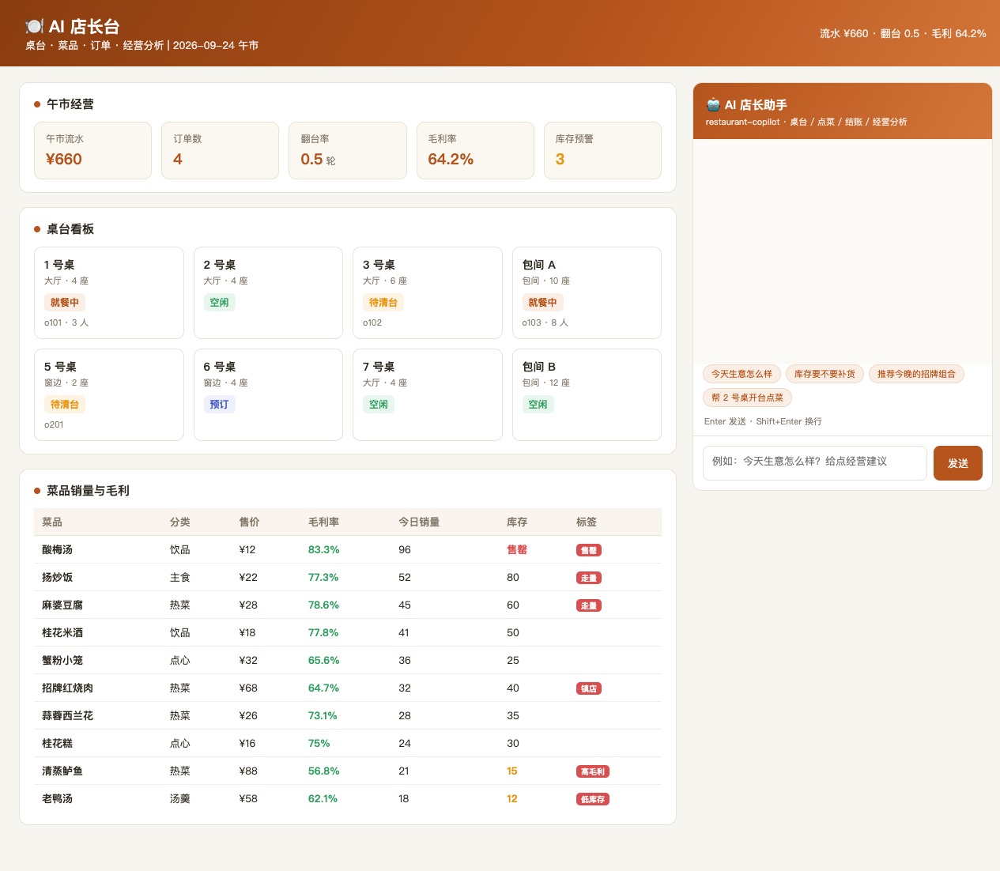
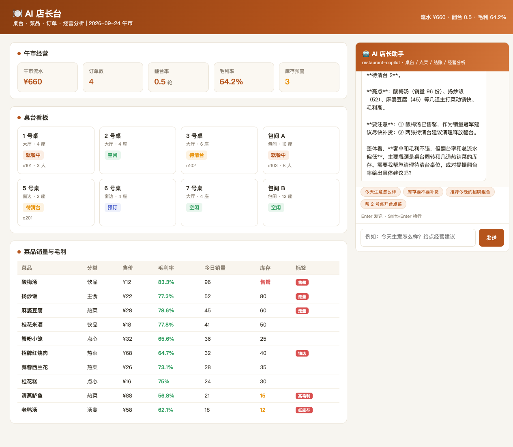
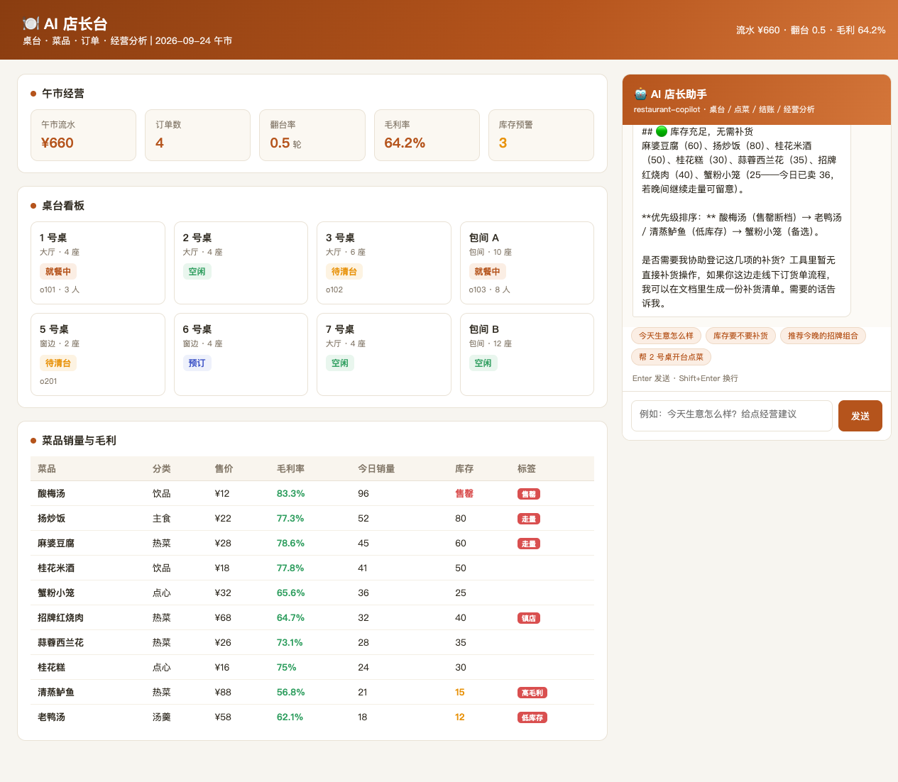

# AI 店长台 · 使用说明

> 面向餐饮门店店长/前厅管理者的操作手册。系统由「数据看板 + AI 助手」两部分组成：左侧是午市经营数据，右侧可直接用自然语言指挥 AI 干活。

## 一、页面导览

打开 `http://127.0.0.1:18092/`：

1. **顶部横幅**：午市流水、翻台率、毛利率、日期——一眼看清今日大盘。
2. **午市经营卡**：流水 / 订单数 / 翻台率 / 毛利率 / 库存预警数 5 个关键指标。
3. **桌台看板**：8 张桌按状态着色（空闲=绿、就餐中=橙、待清台=黄、预订=蓝），显示当前订单与人数。
4. **菜品销量与毛利表**：10 道菜的售价、毛利率（绿=高）、今日销量、库存（橙=偏低、红=售罄）与标签。
5. **AI 店长助手**（右侧面板）：快捷提问 + 输入框，支持 SSE 流式回答。

## 二、AI 能干什么（对应 5 个工具）

| 你说的话 | AI 做的事 | 背后工具 |
|----------|-----------|----------|
| "哪些桌空着？" | 列出全部桌态并点名空桌，提醒待清台 | `table_board` |
| "推荐利润高的菜" | 按毛利率×库存筛选，给出主推建议 | `menu` |
| "5 号桌两位，点蟹粉小笼和米酒" | 校验桌台空闲 + 库存，确认后下单并报合计 | `order_create` |
| "5 号桌结账" | 找到该桌订单结账，报金额，提醒清台 | `checkout` |
| "今天生意怎么样" | 流水/翻台率/爆款/预警 + 可执行动作清单 | `analysis` |

## 三、典型对话示例

**例 1 · 看台开台**

> 你：5 号桌来两位客人，帮忙开台点一份蟹粉小笼和一份酸梅汤
> AI：5 号桌空闲可以开台。但**酸梅汤已售罄**，是否改为桂花米酒（¥18，库存 50）？
> 你：可以
> AI：✅ 下单成功！订单 o201，蟹粉小笼 ¥32 + 桂花米酒 ¥18，合计 **¥50**。

（售罄菜品会被主动拦截，不会硬下单。）

**例 2 · 结账清台**

> 你：5 号桌吃完了，帮我结账
> AI：✅ 结账成功！应收 ¥50，5 号桌已转**待清台**，建议尽快安排清台释放桌位。

**例 3 · 经营分析**

> 你：看看今天的经营分析，有什么要注意的
> AI：流水 ¥660 / 翻台率 0.5 偏低 / 酸梅汤售罄（销量冠军，建议立即补货）/ 清蒸鲈鱼、老鸭汤库存偏低 / 建议主推麻婆豆腐、扬炒饭拉毛利。

## 四、安全规则（系统提示词已内置）

1. 开台前**必须确认桌台空闲**，不允许覆盖就餐中/预订的桌。
2. 点菜前**必须确认菜品库存**，售罄/库存不足时主动告知并给替代推荐。
3. 下单后**必须报订单号与合计金额**，不擅自加菜或改数量。
4. 经营建议必须基于工具返回的真实数据，不编造流水。

## 五、常见问题

**Q：AI 下单报"至少点一道菜"？**
下单请求的菜品字段是 `items:[{dishId,qty}]` 数组格式，确认 AI 传参正确（工具内部已做解析兜底）。

**Q：翻台率怎么算的？**
翻台率 = 当前订单数 ÷ 总桌数（8 桌），午市口径，仅看当前在店订单。

**Q：结账后桌台还是黄色？**
结账后桌台进入「待清台」是设计行为，提醒安排清理；实际清台后状态才会回到「空闲」。

**Q：AI 没反应？**
确认 DSH 服务（127.0.0.1:8090）在运行、`restaurant-copilot` 插件处于 ACTIVE 状态，见 README「快速开始」。
